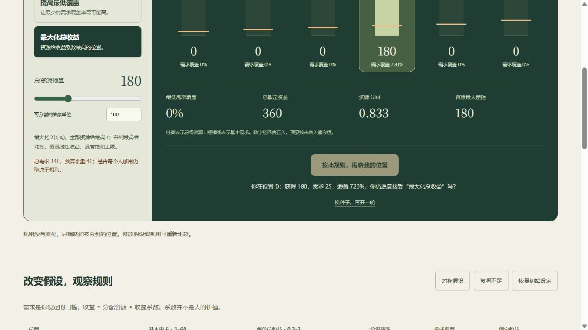

# Veil Lab · 无知之幕实验桌

[在线体验](https://wangchuan2003-a11y.github.io/veil-lab/) · [测试记录](https://github.com/wangchuan2003-a11y/veil-lab/actions/runs/34048212178)



**不知道自己会是谁，你会接受怎样的分配？**

六个虚构位置、固定资源预算。调整需求与收益假设，在均分、基本需求优先、提高最低覆盖、最大化总收益之间选择，再揭晓你的位置。

- 实时展示每人的资源、需求覆盖率和假定收益，以及四种规则的并排对照。
- 提供对称假设、资源不足示例；支持键盘、手机与零预算。
- 按种子复现抽到的位置；URL 和 JSON 保存全部模型参数，导入后回到幕前。
- 规则能够改变分配，指标无法替你决定什么是公平。

## 规则有明确边界

资源可分割且非负，总分配等于预算（浮点计算容差见测试）。设预算 B、需求 n、收益系数 r、分配 x：

| 规则         | 定义                                           |
| ------------ | ---------------------------------------------- |
| 每人一样多   | xᵢ = B / 6                                     |
| 基本需求优先 | 不足需求总和时按需求比例分配；满足后余量均分   |
| 提高最低覆盖 | 最大化 min(xᵢ/nᵢ)，解为 B nᵢ / Σn              |
| 最大化总收益 | 最大化 Σrᵢxᵢ；最高收益系数者获得预算，并列均分 |

这里只是算法化的思想实验，不等同于 Rawls 的原初状态、差别原则或完整功利主义理论。需求与线性收益是设定；Gini 只量化资源差异，不衡量正义。零资源时 Gini 未定义。不存在真实人物、金钱或实证成效承诺。详见[参考与边界](docs/REFERENCES.md)。

## 本地运行

Node.js 22：

```sh
npm ci
npm run dev
```

打开 [http://127.0.0.1:5196](http://127.0.0.1:5196)。

```sh
npm test
npm run build
npx playwright install chromium
npm run test:e2e
```

浏览器测试自动启动 4196 端口的生产预览，需要先构建。CI 在桌面与触屏视口执行 Chromium 测试，main 非 PR 检查通过后发布 GitHub Pages。仓库 Pages 来源应设为 GitHub Actions。

## 数据与许可

所有模型运算、导入、导出在浏览器内完成，没有账号、遥测或模型上传。链接持有者可以读取完整设定；它不是私密分享。没有自动云端或本机草稿，重要实验请导出 JSON。伪随机抽样用于可复现探索，不适合真实资源分配。

[MIT](LICENSE) © 2026 wangchuan2003-a11y
